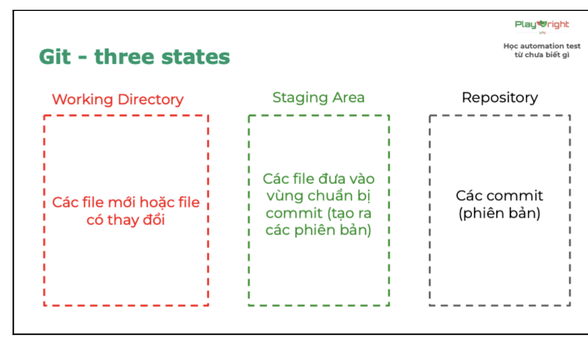

# Key takeaways - Buổi 2

## Git là gì - Global information tracker

Git là hệ thống quản lý phiên bản (version control), giúp theo dõi lịch sử của file/code theo thời gian, và cho phép nhiều người cùng làm việc trên project

Các vùng trong git

- **Local**: Quy ước riêng của lớp - Vùng chứa file khi thư mục chưa chạy `git init`.
- **Working directory**: nơi chứa file sau khi `git init`, git đã "nhìn thấy" nhưng thay đổi chưa được ghi nhận.
- **Staging area**: vùng tạm chứa các thay đổi đã được chọn (qua `git add.`) để chuẩn bị commit.
- **Repository**: nơi lưu vĩnh viễn các thay đổi đã commit, thành lịch sử của project.



## Các lệnh cơ bản

### Làm 1 lần duy nhất

- Khởi tạo repo local: `git init`
- Tạo repo GitHub và liên kết tới repo local: `git remote add origin <url>`

### Làm mỗi khi có thay đổi

- Thêm file vào staging: `git add <file>`/ `git add .`<file></file>
- Commit file: `git commit -m "<message>"` //`lưu các thay đổi đang ở staging area vào repository : git commit -m"init project"`
- Push code: `git push origin main`

## JavaScript cơ bản

- **Hello World**: cách in giá trị ra console bằng `console.log()`.
- **Biến (variable)**: dùng `let`/`var` để khai báo, giá trị có thể thay đổi sau khi gán.
- **Hằng (constant)**: dùng `const` để khai báo, giá trị không thể thay đổi sau khi gán.
- **Number**: kiểu dữ liệu số, dùng cho các phép tính toán học.
- **String**: kiểu dữ liệu chuỗi ký tự, đặt trong `'...'`, `"..."` hoặc `` `...` ``.
- **Boolean**: kiểu dữ liệu chỉ có 2 giá trị `true`/`false`.
- **So sánh (comparison)**: các toán tử so sánh 2 giá trị, ví dụ `==`, `===`, `>`, `<`, `>=`, `<=`.
- **Toán tử một ngôi (unary operator)**: toán tử chỉ tác động lên 1 giá trị, ví dụ `!` (phủ định), `++`/`--` (tăng/giảm 1 đơn vị), `typeof`.
- **Toán tử toán học (arithmetic operator)**: tương tự các phép tính cộng trừ nhân chia đã học: `+`, `-`, `*`, `/`.

  Ví dụ:

```js
  const firstNumber = 5;
  const secondNumber = 10;
  const result = firstNumber + secondNumber; // result = 15
```

  Lưu ý: khi chia cho 0, kết quả sẽ ra `Infinity` (vô cực).
